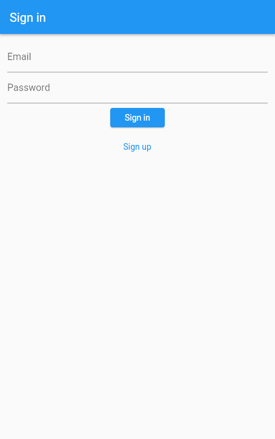

# Flutty Birdle

A personal development project.

## Getting Started

Flutty Birdle is a Flutter based Twitter clone with core Twitter functionality. I staret this project to icrease my knowling in Dart and Flutter as well as Firebase. At the end I design this app that has sign in and sign up screens, timeline, profile, metion and hashtag futures and more. 

Further more i write 3 part blog post about my learing and development journey. You can check out the first part of the post from [here](https://umitkara.github.io/blog/page2).

## Screenshots

Sign in

Sign up

Timeline

Drawer

Search

Profile

Explore

Messages

Conversation